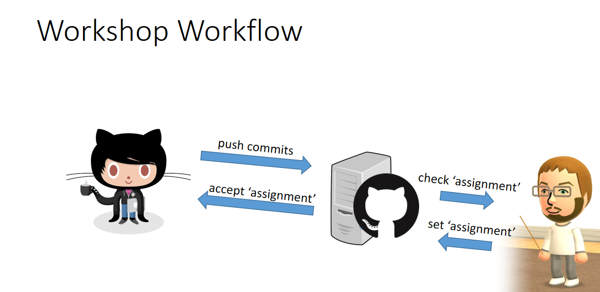

# BU2010_Thinking about data
 
## Introduction

### Overview

Today we had a look at GitHub's documents and repositories that introduce GitHub, a code hosting platform for version control and collaboration. Now we will start to work ourselves with GitHub.

### Editing

You can create documents and edit them directly in GitHub's web interface. This is a very convenient way of creating and editing the files. 
In most cases, the preferred way of working is to create and edit the files on your own machine. This is more difficult if you work on an iPad or other type of tablet, but how you want to work is up to you. 

To get the repository to your own machine you can use [GitHub Desktop](https://desktop.github.com/). 
There are other ways I mentioned in class, but using GitHub Desktop is very convenient.

* You commit changes and push the commits to your GitHub account to create a history of the changes over time.
* You _can_ work on several machines and use commits as a way of keeping the files on different machines up to date. 

## Task Explanation

If you can read this you will have already created a GitHub account and have accepted this task (GitHub Classroom calls it an assignment). 

Below is today's task. For this task, you need to work in the file you are currently reading. It is a Markdown file. More explanations about the Markdown syntax can be found [on this page](https://guides.github.com/features/mastering-markdown/).

* Under the heading _Your Task_ you will find several questions. 
  * Use the GitHub web interface to add the first answer under one of the questions. 
  * It doesn't matter which question you answer first. 
* Commit after you gave the first answer. 
* Clone the repository to your local machine. 
  * If you have already cloned the repository to your local machine earlier make sure you do a fetch (fetch origin) so that you got the latest version of the file(s) on your machine before you continue.  
* This time work on the file(s) stored on your local machine and answer the rest of the questions. 
* Commit
* Push your Commit(s)

**Commit early, commit often** - that way you can go back if you have made a mistake and I can see all the work you have done. There's no problem if you commit and there's a mistake in your file or if you haven't answered all questions yet.  

Once you are done be sure to commit your changes (that will save them to the repository) and to push them to GitHub (so that I can see the work you have done).

## Your Task

The grade will be awarded based on your correct use of GitHub, not based on how good your answers to the questions are. 
Even though the quality of your answers does not determine the grade please try to write good quality answers to the questions anyway. 

#### Question 1
How long does it take you to get to UCLan? 

**Answer:** Replace this text with your answer.

#### Question 2
Is it different on different weekdays or in different months?

**Answer:** Replace this text with your answer.

#### Question 3
How could you use data to help you answer these questions?

**Answer:** Replace this text with your answer.

#### Question 4
Can you turn the data into insights?

**Answer:** Replace this text with your answer.